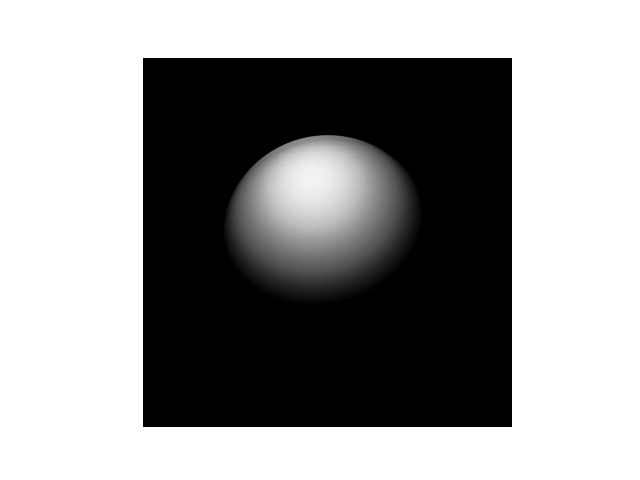

# Project 2

## Milestone 1

### Serial Code Implementation

Serial code implementation `serial/serial_code.cu`
To run the code

Without Valgrind
<hr>

```
cd serial

make

./serial <grid_points> <num_rays>
```

With Valgrind
<hr>

```
cd serial

make RayTracingSerialWithValgrind

valgrind --leak-check=yes ./serial <grid_points> <num_rays>
```

The image is made for `grid size = 1000` and `num of rays = 100000000` 
### Image for milestone 1


## Milestone 2

### Paralle Code Implementation

Parallel Code implementation `parallel/parallel_code.cu`

```
cd parallel

make

./parallel <grid_points> <num_rays> <threads_per_block>
```


### Experiment with different block and thread configs:

Here grid size = 1000 and no of rays = 10000000  (both are kept constant)

No of Threads Per Block | 32 | 64 | 128 | 256 |
--- | --- | --- | --- |--- 
time elapsed device: (sec) | 0.428597 | 0.430513 | 0.419821 | 0.414252 |

Optimal settings = 256 threads per block

### Compare runtime between CPU and GPU

The optimal structure used for GPU here is `256 threads per block` and `no of blocks = num of rays /(256)`

grid_size = 1000 (constant)

No of rays | 10000 | 100000 | 1000000 | 10000000 | 100000000 |
--- | --- | --- | --- |--- |--- 
CPU time: (sec) | 0.163046 | 0.200292 | 0.571290 | 4.267502 | 41.105978 |
GPU time: (sec) | 0.001255 | 0.005879 | 0.049273 | 0.434843 | 3.752551 |


### Image

The image is made for `grid size = 1000` and `num of rays = 1000000000`


